# 🤝 Contributors

The D.U.C.K knowledge base is the result of a collaboration between many experts in the fields of Node Operations, Security, and Risk.&#x20;

The [#core-team](contributors.md#core-team "mention") created the initial draft version and contributed their individual expertises & knowledge to collect helpful and valuable information for the Node Operator community overall.

A special thanks also to all the [#contributors](contributors.md#contributors "mention") who offered dedicated support for creation and content review during the development process.&#x20;

This work is bootstrapped by Lido.

***

## Core Team

<figure>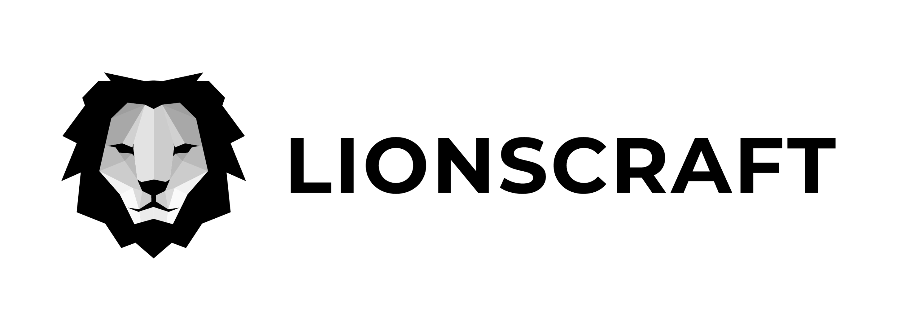<figcaption>
<a href="https://www.lionscraft.io">Lionscraft.io</a>
</figcaption></figure>

 

<figure><figcaption>
<a href="https://www.chainproof.co/">Chainproof.co</a>
</figcaption></figure>

<figure>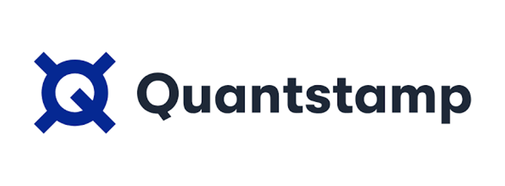<figcaption>
<a href="https://quantstamp.com/">Quantstamp.com</a>
</figcaption></figure>

 

<figure>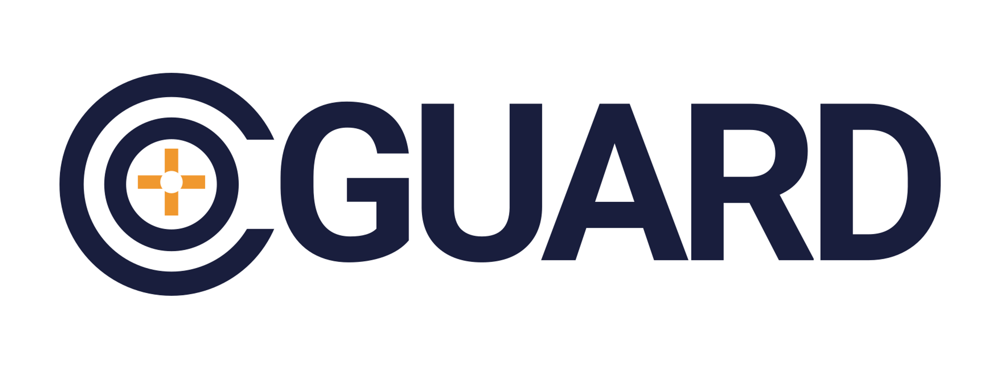<figcaption>
<a href="https://www.coguard.io/">CoGuard.io</a>
</figcaption></figure>

<figure>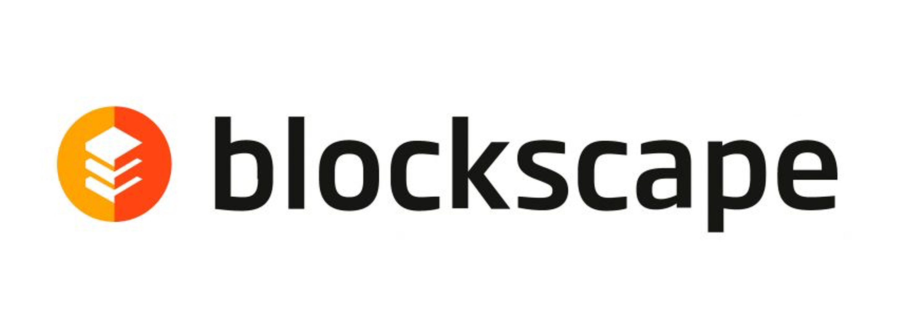<figcaption>
<a href="https://blockscape.network/">Blockscape.network</a>
</figcaption></figure>

 

<figure>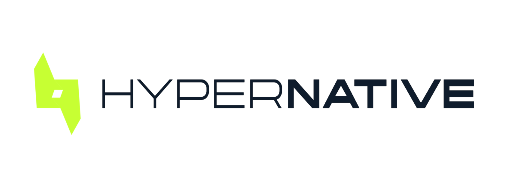<figcaption>
<a href="https://www.hypernative.io/">Hypernative.io</a>
</figcaption></figure>

<figure>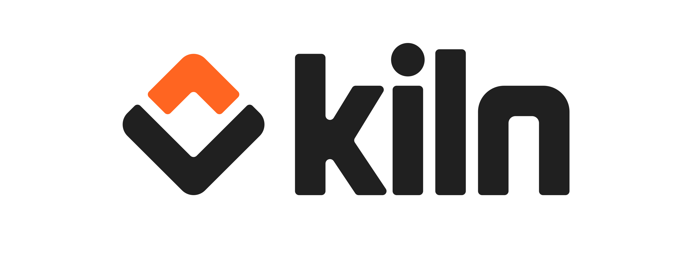<figcaption>
<a href="https://www.kiln.fi/">kiln.fi</a>
</figcaption></figure>

 

<figure><figcaption></figcaption></figure>

***

## Contributors

<figure>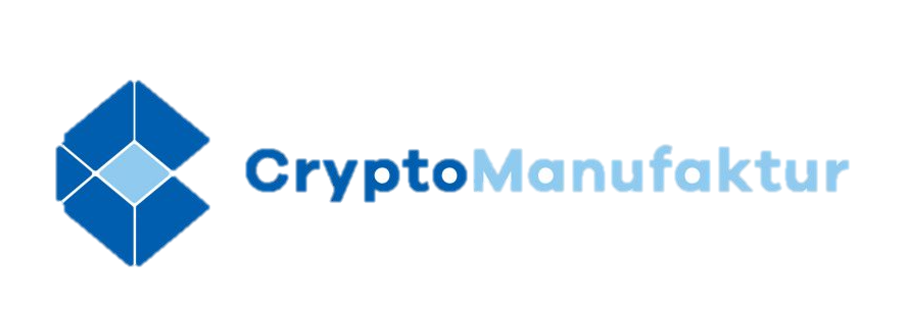<figcaption></figcaption></figure>

 

<figure>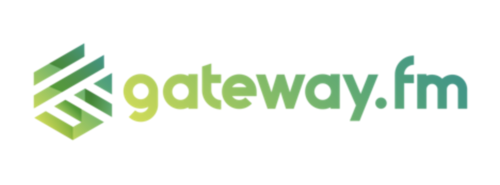<figcaption></figcaption></figure>

<figure>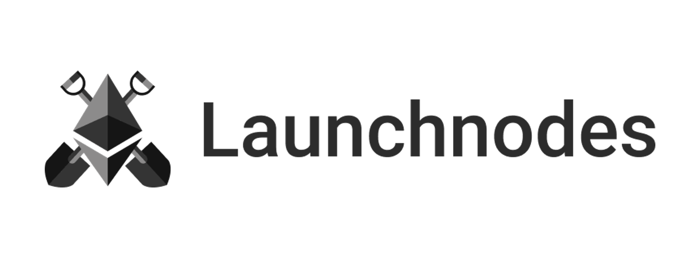<figcaption></figcaption></figure>

 

<figure>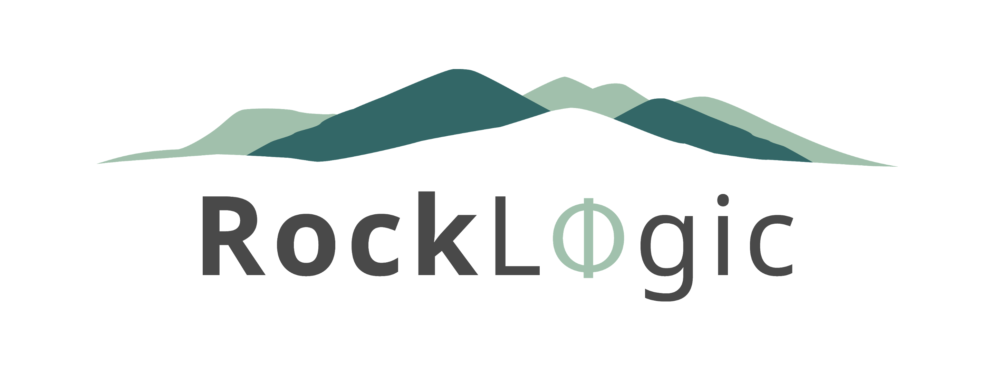<figcaption></figcaption></figure>

<figure>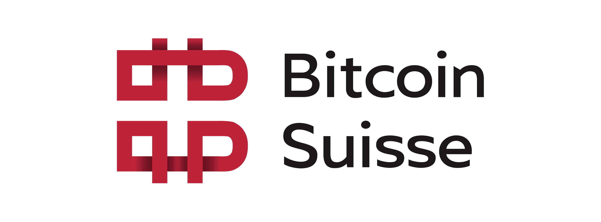<figcaption></figcaption></figure>

 

<figure><figcaption></figcaption></figure>

<figure>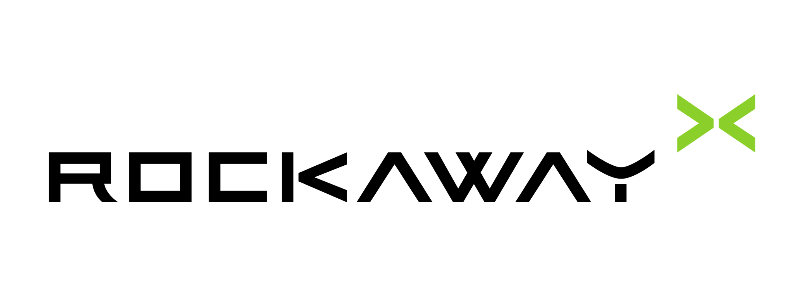<figcaption></figcaption></figure>

 

<figure><figcaption></figcaption></figure>

<figure><figcaption></figcaption></figure>

 

<figure><figcaption></figcaption></figure>

